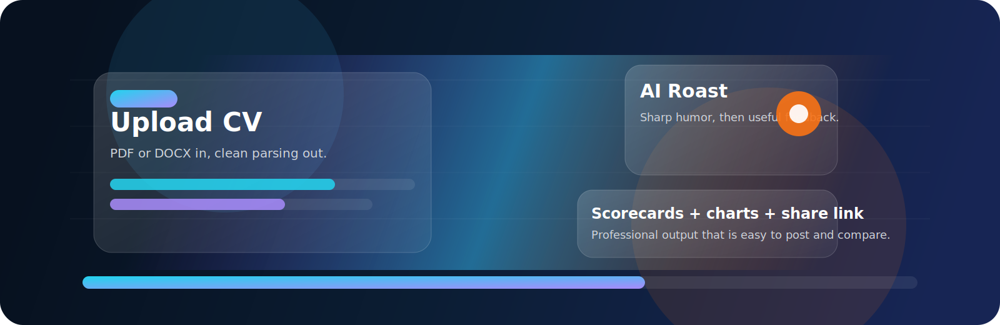
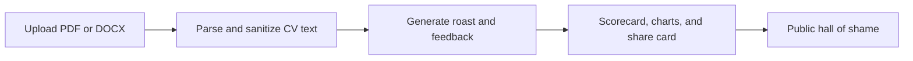

# Roast My CV

<p align="center">
	
</p>

<p align="center">
	<a href="https://nextjs.org"></a>
	<a href="https://fastapi.tiangolo.com"></a>
	<a href="https://www.mongodb.com"></a>
	<a href="https://www.docker.com"></a>
</p>

<p align="center">
	A cinematic AI CV review app that turns a resume upload into a sharp roast, serious feedback, visual scores, shareable cards, and a hall-of-shame leaderboard.
</p>

## Why it feels premium

- Animated visual identity with a custom SVG hero that makes the project feel like a product launch.
- Fast, clean flow from upload to roast to shareable result page.
- Balanced tone: funny first, useful second, with scorecards and charts that make the feedback actionable.
- Production-friendly stack with Docker Compose, MongoDB, FastAPI, and a Next.js frontend.

## Product Flow



## What You Get

<table>
	<tr>
		<td><strong>Funny AI roast</strong><br />A punchy summary that keeps the app memorable.</td>
		<td><strong>Serious feedback</strong><br />Clear recommendations that help improve the CV.</td>
	</tr>
	<tr>
		<td><strong>Scorecards and charts</strong><br />Visual breakdowns that look good on a results page.</td>
		<td><strong>Shareable output</strong><br />A public-style result page built for screenshots and social sharing.</td>
	</tr>
</table>

## Stack

- Frontend: Next.js App Router, React, Tailwind CSS, Recharts
- Backend: FastAPI, Motor, PyPDF2, python-docx, OpenAI
- Database: MongoDB
- Runtime: Docker Compose

## Quick Start

```bash
cd Roast_MY_CV
cp .env.example .env
docker compose up --build
```

Add `OPENAI_API_KEY` to `.env` for real GPT-powered roasts. Without a key, the backend falls back to a local roast so the app still works.

Open:

- Frontend: http://localhost:3000
- Backend health: http://localhost:8000/health

## Local Development

Run MongoDB locally or with Docker:

```bash
docker compose up mongo
```

Backend:

```bash
cd backend
python -m venv .venv
source .venv/bin/activate
pip install -r requirements.txt
MONGODB_URI=mongodb://localhost:27017/roast_my_cv uvicorn main:app --reload
```

Frontend:

```bash
cd frontend
npm install
NEXT_PUBLIC_API_URL=http://localhost:8000 npm run dev
```

## API

- `POST /upload-cv` uploads and parses a PDF or DOCX CV, max 5MB.
- `POST /roast` streams an SSE roast for a `session_id`.
- `GET /roast/{id}` returns a saved roast.
- `GET /hall-of-shame` lists anonymized public roasts.
- `POST /hall-of-shame/{id}/submit` publishes a roast anonymously.
- `POST /hall-of-shame/{id}/upvote` upvotes a public roast.

## Data and Safety

The app never stores uploaded files. It extracts text, sanitizes it, labels likely CV sections, stores only text plus roast metadata, and rate limits roast and upload requests per IP.

## Notes

- The animated header is an SVG asset in this repo, so the README stays lightweight and portable.
- If you want a real product demo video later, you can drop one into the frontend public folder and embed it here.
